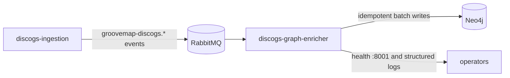

# discogs-graph-enricher

`discogs-graph-enricher` is the GrooveMap service that consumes versioned Discogs
catalog events and projects them into Neo4j. It owns the Discogs-derived artist,
label, master, release, genre, style, media, and credit nodes and the relationships
between them. It does not download Discogs exports or serve the public API.



## Inputs and outputs

The service consumes the `artists`, `labels`, `masters`, and `releases` queues from
the promoted [`groovemap.catalog-events` v1 contract](contracts/catalog-events/v1/contract.json).
It also handles `file_complete` and `extraction_complete` control messages. Exchange
and queue names are generated from that contract rather than duplicated in application
code.

Neo4j writes follow the promoted
[`groovemap.persistence` compatibility contract](contracts/persistence/v1/compatibility.json).
Record hashes make repeated deliveries idempotent. Once every queue has reported
completion for the same extraction version, the service flushes pending batches,
removes unresolved stub nodes, and refreshes aggregate graph statistics.

### Retained technical identifiers

Some identifiers intentionally remain stable across the repository extraction:

- `graphinator` is the Python import package and the v1 catalog-contract consumer key.
  The latter preserves durable queue names such as
  `groovemap-discogs-graphinator-artists`; renaming those queues requires a coordinated
  contract migration so in-flight messages are not stranded. It is not the service,
  image, health identity, log identity, or ephemeral RabbitMQ consumer tag.
- `groovemap-discogs` is the versioned AMQP exchange prefix shared with
  `discogs-ingestion`.
- `discogsography-*` strings that remain in code or regression-test comments are
  historical issue identifiers. They are provenance for specific failure fixes, not
  active product branding or wire values.

## Failure and drain behavior

- Transient Neo4j failures are retried with bounded backoff without spending the
  RabbitMQ delivery-limit budget on healthy records.
- Poison records are isolated so healthy records in the same batch can complete.
- Shutdown first cancels consumers, then drains or safely re-enqueues in-flight work;
  a delivery is never negatively acknowledged while its consumer is still subscribed.
- Pending batch writes and detached post-import maintenance are awaited before the
  Neo4j driver closes.

The historical failure modes are guarded by the shutdown-delivery-churn, file-completion,
batch-drain, and transient-classification regression suites. See
[consumer cancellation](docs/consumer-cancellation.md),
[file completion tracking](docs/file-completion-tracking.md), and
[database resilience](docs/database-resilience.md) for the operating contracts.

## Operations

The container image is `ghcr.io/groovemap-music/discogs-graph-enricher`. The process
runs as a non-root user, writes structured logs under
`/logs/discogs-graph-enricher.log`, and exposes health on port `8001`. Deployment owns
runtime composition and credentials; this repository owns the image and its application
contract.

This consumer makes no HTTP requests to Discogs and therefore emits no Discogs
`User-Agent`. Discogs HTTP identity belongs to the upstream `discogs-ingestion` service;
all identity emitted here uses GrooveMap and `discogs-graph-enricher`.

## Development

This service consumes `groovemap-runtime` from `groovemap-music/python-libraries`; the
lockfile records the reviewed immutable revision.

```bash
mise install
just setup
just check
just image
```

`just check` uses mocked Neo4j and RabbitMQ boundaries. Live integration, load, and
deployment checks remain separate. See the
[service reference](graphinator/README.md) for configuration and the graph data model.

Cross-repository dependency access uses a narrowly installed GitHub App and a short-lived
token; personal access tokens are not accepted.

## Contracts

- Catalog-event contract: v1, promoted byte-for-byte from `discogs-ingestion`.
- Persistence compatibility: v1, promoted from `database-schema`.

`just source-check` verifies both promoted files and the generated Python binding by
SHA-256. There are no cross-repository relative imports or generated writes.

## Release and license

This repository versions one service wheel and container image. Commitizen reads the PEP
621 version and uses annotated `v$version` tags. Dry runs do not tag, push, publish, or
release.

The current tree is MIT licensed by owner decision. Historical revisions retain their
then-applicable license.

## Documentation

See the [documentation index](docs/README.md) and the
[graphinator reference](graphinator/README.md).
