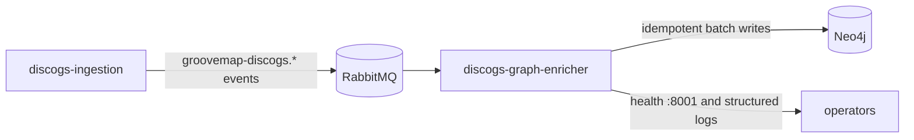

# discogs-graph-enricher

`discogs-graph-enricher` is the GrooveMap service that consumes versioned Discogs
catalog events and projects them into Neo4j. It owns the Discogs-derived artist,
label, master, release, genre, style, media, and credit nodes and the relationships
between them. It does not download Discogs exports or serve the public API.



## Inputs and outputs

The service consumes the `artists`, `labels`, `masters`, and `releases` queues from
the promoted [`groovemap.catalog-events` v1 contract](contracts/catalog-events/v1/contract.json).
It also handles `file_complete` and `extraction_complete` control messages. Exchange
and queue names are generated from that contract rather than duplicated in application
code.

Neo4j writes follow the promoted
[`groovemap.persistence` compatibility contract](contracts/persistence/v1/compatibility.json).
Record hashes make repeated deliveries idempotent. Once every queue has reported
completion for the same extraction version, the service flushes pending batches,
removes unresolved stub nodes, and refreshes aggregate graph statistics.

### Retained technical identifiers

Some identifiers intentionally remain stable across the repository extraction:

- `graphinator` is the Python import package, the v1 catalog-contract consumer key,
  and the default OpenTelemetry `service.name` retained for compatibility. The
  consumer key preserves durable queue names such as
  `groovemap-discogs-graphinator-artists`; renaming those queues requires a coordinated
  contract migration so in-flight messages are not stranded. It is not the service,
  image, health identity, log identity, or ephemeral RabbitMQ consumer tag.
- `groovemap-discogs` is the versioned AMQP exchange prefix shared with
  `discogs-ingestion`.
- `discogsography-*` strings that remain in code or regression-test comments are
  historical issue identifiers. They are provenance for specific failure fixes, not
  active product branding or wire values.

## Telemetry

The service pushes OpenTelemetry metrics and traces to a collector over OTLP/HTTP-protobuf and
serves no Prometheus scrape route. Configuration is standard OpenTelemetry environment
variables only; with `OTEL_EXPORTER_OTLP_ENDPOINT` unset nothing is recorded and nothing is
exported. Domain metrics cover per-message and per-batch pipeline work, the process's own CPU,
memory, threads, and garbage collection arrive with the runtime instrumentation, and event-loop
lag is sampled once a second. Each delivery is processed inside a `process {queue}` CONSUMER
span joined to the trace `discogs-ingestion` started, and each Neo4j batch flush is a
`flush neo4j {entity}` span linked to the deliveries it wrote. See the
[service reference](graphinator/README.md#opentelemetry-metrics) for the instrument and span
catalog.

## Failure and drain behavior

- Transient Neo4j failures are retried with bounded backoff without spending the
  RabbitMQ delivery-limit budget on healthy records.
- Poison records are isolated so healthy records in the same batch can complete.
- Shutdown first cancels consumers, then drains or safely re-enqueues in-flight work;
  a delivery is never negatively acknowledged while its consumer is still subscribed.
- Pending batch writes are drained before the Neo4j driver closes. Detached
  post-import maintenance is cancelled on shutdown and can be repeated safely.
- Delivery settlement and Discogs batch lifecycle are shared through the immutable
  `groovemap-runtime` `common.delivery` and `common.batch` contracts. Fix lifecycle
  defects there once; keep Discogs normalization, Neo4j projection and exception
  mapping, telemetry, QoS, completion state, and maintenance in this repository.

The historical failure modes are guarded by the shutdown-delivery-churn, file-completion,
batch-drain, and transient-classification regression suites. See
[consumer cancellation](docs/consumer-cancellation.md),
[file completion tracking](docs/file-completion-tracking.md), and
[database resilience](docs/database-resilience.md) for the operating contracts.

## Operations

The container image is `ghcr.io/groovemap-music/discogs-graph-enricher`. The process
runs as a non-root user, writes structured logs under
`/logs/discogs-graph-enricher.log`, and exposes health on port `8001`. Deployment owns
runtime composition and credentials; this repository owns the image and its application
contract.

This consumer makes no HTTP requests to Discogs and therefore emits no Discogs
`User-Agent`. Discogs HTTP identity belongs to the upstream `discogs-ingestion`
service. Application, image, health, and log identity here use GrooveMap and
`discogs-graph-enricher`; the retained telemetry default is documented above and can
be overridden with `OTEL_SERVICE_NAME`.

## Development

This service consumes `groovemap-runtime` from `groovemap-music/python-libraries`; the
lockfile records the reviewed immutable revision.

```bash
mise install
just setup
just --summary
just source-check
just check
just test-integration
just image
```

`just source-check` runs the locked Ruff formatter and linter plus promoted-contract
verification. `just check` adds types, coverage, secret scanning, package and install
checks, licenses, and a version-bump preview. It uses mocked Neo4j and RabbitMQ
boundaries and never opens a network connection. `just test-integration` requires Docker;
it starts a disposable, loopback-only Neo4j container, runs representative graph writes
and the historical multi-genre taxonomy regression, and removes the container and its
data on exit. CI invokes this explicit integration tier on pull requests. Live load and
deployment checks remain separate. See the
[service reference](graphinator/README.md) for configuration and the graph data model.

Cross-repository dependency access uses a narrowly installed GitHub App and a short-lived
token; personal access tokens are not accepted.

## Contracts

- Catalog-event contract: v1, promoted byte-for-byte from `discogs-ingestion`.
- Persistence compatibility: v1, promoted from `database-schema`.

`just source-check` verifies both promoted files and the generated Python binding by
SHA-256. There are no cross-repository relative imports or generated writes.

## Release and license

This repository versions one service wheel and container image. Commitizen reads the PEP
621 version and uses annotated `v$version` tags. Dry runs do not tag, push, publish, or
release.

The current tree is MIT licensed by owner decision. Historical revisions retain their
then-applicable license.

## Documentation

See the [documentation index](docs/README.md) and the
[graphinator reference](graphinator/README.md) for the full graph data model,
including [the media graph model and the `Release.formats` deprecation](docs/database-schema.md)
and [company credits and release country](docs/company-credits.md).
