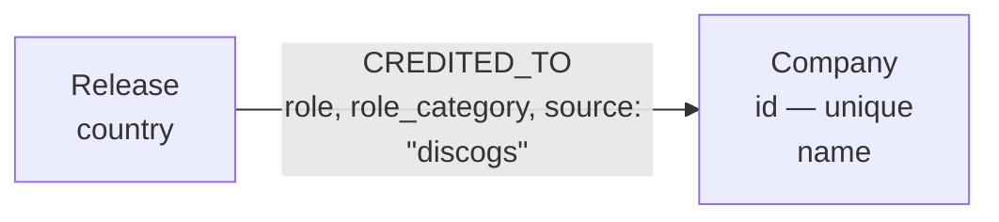

# Company credits and release country

This document is the authoritative description of the manufacturing-credit graph model
that `discogs-graph-enricher` writes — `Company` nodes, `CREDITED_TO` edges, and the
`Release.country` property. For the full node and relationship catalog beyond company
credits see the [Graph Data Model](../graphinator/README.md#graph-data-model) section of
the service reference; for the media model see
[the media graph model](database-schema.md).

The model is defined by [ADR 0011: catalog identifiers and manufacturing
credits][adr-0011] in the `groovemap-music/design` repository, which also defines the
closed company-role vocabulary (vendored as `common.company_role_vocabulary`) and the
JSON Schema for the canonical `companies` block every `releases` event carries. This
service is a consumer of that vocabulary, not a second implementation of it: the mapping
of raw Discogs `entity_type_name` strings onto role categories happens once, in the
producer, and rides the event inside the content hash.

The constraint on `Company.id` and the range index on `Release.country` are owned by
[`database-schema`](https://github.com/groovemap-music/database-schema), as every schema
object is; see [Neo4j schema and index ownership](neo4j-indexing.md).

## Nodes and relationships



- **`Company`** — one company credited on the physical article: the pressing plant, the
  room that cut the lacquer, the mastering house, the distributor, a rights holder. The
  issuing label is deliberately not here — it is a label relation, written as
  `(:Release)-[:ON]->(:Label)`, and the role vocabulary records `labels` as the excluded
  field.
- **`CREDITED_TO`** — `Release` → `Company`, one edge per
  `(release, company, role, source)`.
  - `role` — the raw Discogs role string, preserved verbatim (`"Pressed By"`,
    `"Lacquer Cut At"`). It is part of the `MERGE` key, following the
    `(:Person)-[:CREDITED_ON {role}]->(:Release)` precedent, so a company credited under
    two roles on one release is two edges to one node.
  - `role_category` — the vocabulary's verdict on that role (`pressing`, `lacquer`,
    `rights`, ...). An entry that arrives without one is written as `other`, the
    vocabulary's own unmapped category, rather than as a null that would delete the
    property.
  - `source` — which catalog asserted the edge (`"discogs"` for this service). As with
    `ISSUED_ON`, it is part of the `MERGE` key and not a property set afterwards, because
    `Company` nodes are shared across catalogs: merging on the role alone would match
    whichever provider's edge already existed and silently overwrite the other's
    assertion.

## `Company.id`

`Company.id` is the Discogs company id as a string whenever the source supplies one. The
dump states it as element text while the API states it as a number, and the uniqueness
constraint has to see one value for both, so it is stringified on the way in. Discogs
uses `0` for "no label", which is not an id and does not count.

Many companies have no Discogs label page at all — small plants and cutting rooms
especially. Dropping them would lose exactly the manufacturing evidence the model exists
for, and leaving `id` unset would violate the constraint, so such a company is keyed on a
derived id: the literal `name:` followed by its name, case-folded, with inner whitespace
collapsed.

```text
"Damont Audio"   → "name:damont audio"
"  DAMONT   AUDIO  " → "name:damont audio"
```

The normalization is deliberately minimal — case and spacing only, never punctuation.
Two spellings that differ by a comma or a `Ltd.` stay two nodes, which a later
reconciliation can merge; two genuinely different companies folded onto one id could not
be taken apart again. `Company.name` keeps the name as the producer sent it, which is why
the id and the stored name can differ in spacing.

The `name:` prefix namespaces derived ids away from Discogs ids, which are bare digits,
so the two can never collide.

## Re-processing and the source-scoped prune

Discogs records are mutable: a release whose pressing plant is corrected gets a new
`sha256`, passes the hash gate, and is reprocessed. Before the additive `MERGE` runs,
this service deletes the `CREDITED_TO` edges the release's new version no longer asserts:

```cypher
UNWIND $records AS record
MATCH (r:Release {id: record.release_id})-[e:CREDITED_TO]->(co:Company)
WHERE e.source = $source AND NOT [co.id, e.role] IN record.keep
DELETE e
```

The keep-list holds `[company id, role]` **pairs**, not bare company ids, because the edge
is keyed on the role. A release that keeps a company as its distributor but drops it as
its plant has to lose exactly one of its two edges to that node and keep the other.

`WHERE e.source = $source` scopes the delete to this service's own edges — a
`musicbrainz`-sourced credit on the same release is another provider's assertion and is
left untouched. Without the prune, a corrected release would keep the superseded credit
forever, and a plant-centric query would list it under a plant that never pressed it.

## Silence is not removal

A release whose new version carries an **empty** canonical block is pruned with an empty
keep-list — that is exactly how "every company credit was removed from this release" is
applied.

A record that carries **no canonical block at all** is different, and neither statement
runs for it. Two shapes reach this service that way: a pre-cutover producer that has not
started emitting the block, and a pre-cutover record whose `companies` key still holds the
raw Discogs list rather than the canonical object. Both are silent about company credits;
neither asserts that the release has none. Pruning on that silence would delete the
credits a post-cutover event already wrote, so the record is left alone.

This is the one place the company projection deliberately departs from the media
projection, which always prunes. Media can, because it derives a best-effort block from
the raw `formats` list when the event carries none, so it always has an assertion to act
on. There is no equivalent derivation here: the producer's role mapping is fixed by
conformance fixtures that a reference implementation also has to satisfy, and
re-deriving it in the consumer would make this service a second, unverified
implementation of those rules.

## `Release.country`

`Release.country` is the release's country as Discogs states it (`"UK"`, `"US"`,
`"Europe"`), written by both write paths from the event's raw `country` string and backed
by a range index. A blank or non-string value is written as null, so the property is
absent rather than holding an empty string the country facet would have to filter out;
writing null also clears a country that was removed upstream.

The `musicbrainz-graph-enricher` writes its own country assertion as `mb_country` on
releases it matches, so the two catalogs' answers are comparable rather than
last-writer-wins.

## Both write paths run the same statements

The single-record path (`graphinator/entity_projection.py`) and the batched path
(`graphinator/batch_projection.py`) both import the two statements above from
`graphinator/company_projection.py` and execute them verbatim, exactly as they do for
media. Sharing the statements — not just the shapes — is what keeps a release's credits
from depending on whether it happened to arrive in a batch.
`tests/test_company_projection.py` runs every case through both paths and asserts the
same rows, the same prune records, and the same Cypher.

## Example query: releases pressed at a plant

```cypher
MATCH (co:Company {name: "Damont"})<-[e:CREDITED_TO {source: "discogs"}]-(r:Release)
WHERE e.role_category = "pressing"
RETURN r.title, r.country, e.role
ORDER BY r.title
```

Scoping `CREDITED_TO` to `source: "discogs"` matches this service's own convention: omit
it to include MusicBrainz-asserted credits over the same `Company` nodes as well.

[adr-0011]: https://github.com/groovemap-music/design/blob/main/docs/adr/0011-catalog-identifiers-and-manufacturing-credits.md
