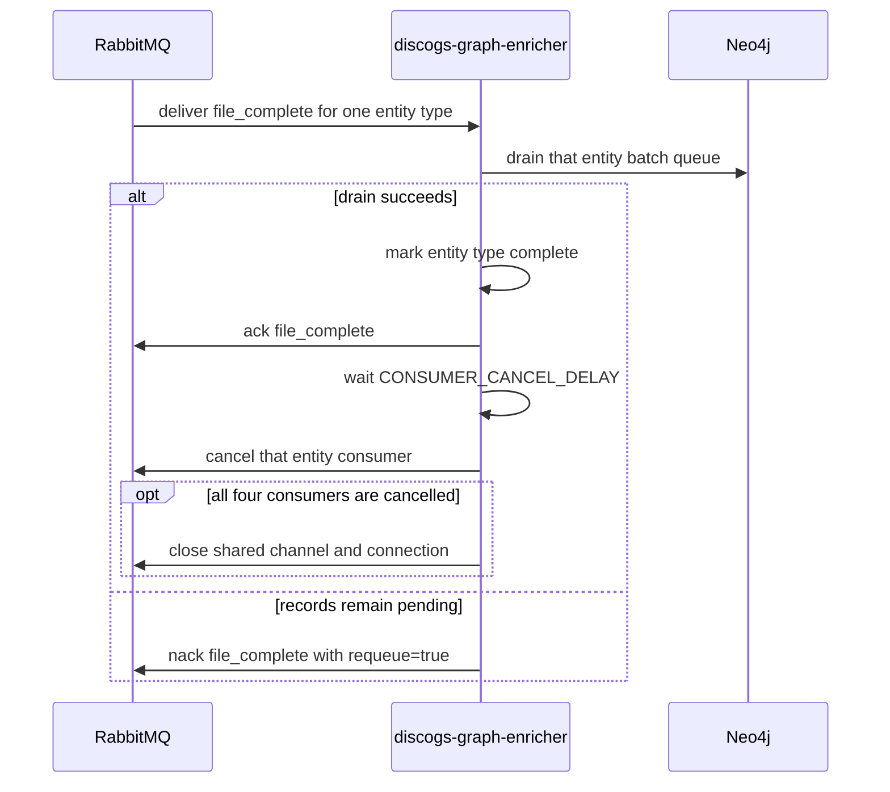

# Consumer cancellation and draining

`discogs-graph-enricher` owns four RabbitMQ consumers, one for each Discogs entity
type. The current producer is
[`discogs-ingestion`](https://github.com/groovemap-music/discogs-ingestion); this
document begins at delivery to this service's durable queues.

## Per-queue completion



The completion marker never overtakes its data. `flush_queue()` waits for an
in-flight batch and drains the in-memory queue before the marker is acknowledged.
If its bounded retries cannot drain the queue, the marker is requeued and the entity
is not marked complete.

`CONSUMER_CANCEL_DELAY` defaults to `300` seconds. A value of `0` disables the
per-queue cancellation timer. Cancellation uses the queue's registered consumer tag
and `nowait=True`; a newer completion marker replaces an existing timer for the same
entity type. The shared RabbitMQ channel and connection remain open while any
consumer is active and close after all four consumers are cancelled and all four
entity types are complete.

When idle, the service checks queue depth every `QUEUE_CHECK_INTERVAL` seconds
(default `3600`). If any queue has work, it reconnects and registers consumers for
all four entity types, including types whose queues were empty at the instant of the
depth check. Unexpectedly missing consumers are checked every
`STUCK_CHECK_INTERVAL` seconds (default `30`) and use the same recovery path.

## Process shutdown

SIGINT and SIGTERM use a separate, immediate drain path:

1. Cancel every registered consumer before doing slow teardown work.
2. Stop progress, recovery, and periodic batch-flush tasks.
3. Ask every batch queue to drain. Records that cannot be written stay pending; a
   transient database outage is not converted into a dead-letter decision.
4. Cancel delayed consumer-cancellation tasks and any detached maintenance task.
5. Close RabbitMQ, then Neo4j, then telemetry and the health server.

This ordering stops new deliveries before the service begins flushing. It also avoids
nacking the same delivery repeatedly while its consumer remains subscribed.
Post-import maintenance is idempotent; if shutdown interrupts it, the next extraction
completion signal or an operator-initiated rerun must perform it again.

## Operations and tests

Health is available at `http://localhost:8001/health`. Its `active_consumers`,
`completed_files`, `message_counts`, and `current_task` fields describe the local
process; there is no Prometheus scrape route.

```bash
uv run pytest tests/test_file_completion.py tests/test_shutdown_delivery_churn.py \
  tests/test_graphinator.py
```

See [file and extraction completion](file-completion-tracking.md) for the durable
four-signal latch and post-import maintenance gate.
