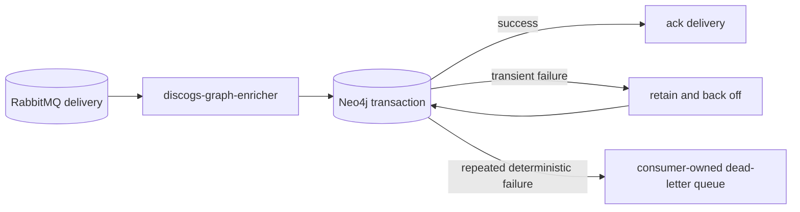

# Neo4j and RabbitMQ resilience

`discogs-graph-enricher` uses the pinned `groovemap-runtime` resilient Neo4j and
RabbitMQ clients. This document describes the service-level decisions layered on
those clients. Connection algorithms and deployment-wide outage procedures belong to
the [shared runtime](https://github.com/groovemap-music/python-libraries) and
[deployment](https://github.com/groovemap-music/deployment/blob/main/docs/database-resilience.md)
repositories.

Transport-neutral delivery settlement and Discogs batch lifecycle changes belong in
`common.delivery` and `common.batch`, respectively. This repository continues to own
the concrete Neo4j exception classification, Discogs normalization and projection,
flush telemetry, broker QoS, completion state, and post-import maintenance.

## Failure policy



- Startup verifies Neo4j before registering RabbitMQ consumers. Both connections use
  bounded retry from the shared runtime.
- In batch mode, transient Neo4j errors put the records back at the front of the local
  entity queue, reduce the effective batch size, and apply bounded backoff. They do
  not increment the poison counter or nack records to the dead-letter queue.
- A repeated deterministic batch failure is isolated and nacked without requeue only
  after the poison retry threshold. Healthy records from the batch can still be
  acknowledged.
- In non-batch mode, the outage backoff prevents a database outage from consuming the
  quorum queue's delivery-limit budget.
- Completion messages are acknowledged only after their required drain or durable
  latch write succeeds. See [file and extraction completion](file-completion-tracking.md).
- Consumer recovery passively checks all four queues, recreates exchanges, durable
  quorum queues, and consumer-owned dead-letter resources from the promoted contract,
  then registers any missing consumers.

The stable queues are:

| Entity | Main queue | Dead-letter queue |
| --- | --- | --- |
| artists | `groovemap-discogs-graphinator-artists` | `groovemap-discogs-graphinator-artists.dlq` |
| labels | `groovemap-discogs-graphinator-labels` | `groovemap-discogs-graphinator-labels.dlq` |
| masters | `groovemap-discogs-graphinator-masters` | `groovemap-discogs-graphinator-masters.dlq` |
| releases | `groovemap-discogs-graphinator-releases` | `groovemap-discogs-graphinator-releases.dlq` |

Each main queue is durable and quorum-backed with `x-delivery-limit=20`. Its dead-letter
exchange and queue append `.dlx` and `.dlq` to the main queue name. These values are
generated from the promoted catalog-event contract and frozen by tests; changing them
requires a coordinated wire migration.

## Operations

Health is exposed at `http://localhost:8001/health` and reports starting, healthy, or
unhealthy state plus active consumers, completed entity types, message counts, and the
current task. Telemetry is pushed using OTLP/HTTP-protobuf. This service exposes no
Prometheus `/metrics` route.

During an outage, watch RabbitMQ queue and dead-letter depth, the health response,
structured logs at `/logs/discogs-graph-enricher.log`, and:

- `groovemap.pipeline.batch.flush.duration`
- `groovemap.pipeline.consumers.active`
- `groovemap.pipeline.reconnects`
- `db.client.operation.duration`
- `groovemap.runtime.event_loop.lag`

Database stopping, restart, credentials, capacity, and service orchestration belong to
the deployment repository. Validate failure behavior only in a disposable environment;
the default repository suite uses mocked boundaries.

```bash
uv run pytest tests/test_batch_processor.py tests/test_graphinator.py \
  tests/test_shutdown_delivery_churn.py
just check
```
