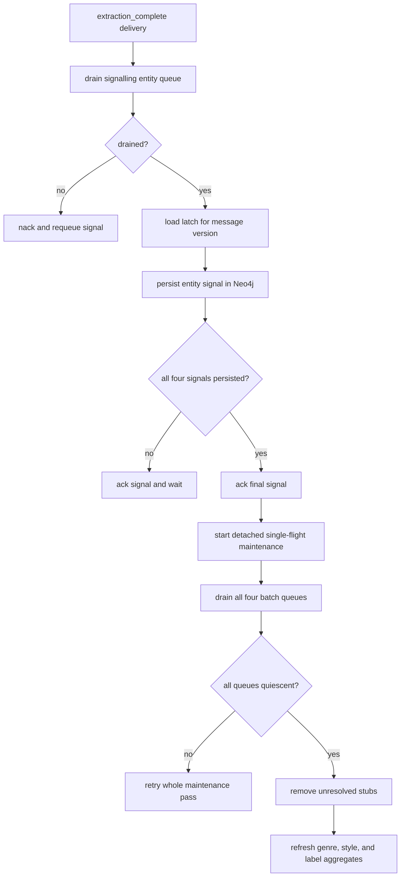

# File and extraction completion

The current [`discogs-ingestion`](https://github.com/groovemap-music/discogs-ingestion)
producer publishes records and terminal control messages through the promoted
[`groovemap.catalog-events` v1 contract](../contracts/catalog-events/v1/contract.json).
This document describes only the consumer-side ordering enforced by
`discogs-graph-enricher`.

## Two completion levels

- `file_complete` says one entity stream has reached its file boundary. The service
  drains that entity's batch queue before acknowledging the marker, then marks the
  type complete and schedules its consumer for cancellation.
- `extraction_complete` says one entity stream has reached the extraction boundary
  for a version. The service drains that entity's queue, persists the signal in
  Neo4j, acknowledges it, and waits for the other entity types.

Both markers are nacked with `requeue=true` when their preceding data cannot be
drained. An extraction signal is also requeued if its durable latch cannot be read or
written.

## Durable extraction gate



The latch is stored as an `ExtractionCompletion` node keyed by the message's
`version`. Changing versions replaces the in-memory cache with the persisted state
for the new version, so signals from two imports cannot satisfy one another. Duplicate
signals are idempotent because the stored `signals` value is a set-like list.

The final message is acknowledged before maintenance begins. Cleanup and aggregate
refreshes can take much longer than RabbitMQ's consumer acknowledgement timeout; the
AMQP delivery is therefore not used as their retry token. Maintenance runs detached,
single-flight, and retries the whole idempotent pass with backoff. Before deleting
stubs it calls `flush_all()` so a transiently requeued batch from any entity type
cannot race cleanup.

Maintenance performs these steps in order:

1. Drain artists, labels, masters, and releases queues, including in-flight batches.
2. Delete unresolved Artist, Label, Master, and Release stubs without `sha256`.
3. Recompute the Genre, Style, and Label aggregate properties documented in the
   [service reference](../graphinator/README.md#pre-computed-node-properties).

If all retry attempts fail, logs report that stubs and aggregates may be stale.
Shutdown cancels an active maintenance task; because each step is idempotent, a later
completion signal or explicit operator rerun can safely repeat it.

## Verification

```bash
uv run pytest tests/test_file_completion.py \
  tests/test_extraction_latch_durable.py \
  tests/test_batch_processor.py \
  tests/test_post_import_maintenance_detached.py
```

See [consumer cancellation](consumer-cancellation.md) for the per-queue grace timer,
idle recovery, and shutdown sequence.
