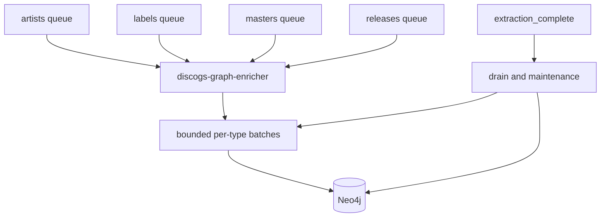

# discogs-graph-enricher service reference

This package contains the GrooveMap Neo4j consumer owned by
`groovemap-music/discogs-graph-enricher`. `graphinator` remains the Python import
package and is not the deployed service or image name. See the repository
[documentation index](../docs/README.md) for resilience, completion, indexing, and
performance guidance.

It consumes versioned Discogs catalog events from RabbitMQ and stores their music
entities and relationships in Neo4j.

## Overview

The `discogs-graph-enricher` service:

- Consumes parsed Discogs data from RabbitMQ queues
- Creates nodes and relationships in Neo4j graph database
- Models complex music industry relationships
- Implements efficient batch processing
- Provides deduplication using SHA256 hashes



## Architecture

- **Language**: Python 3.14
- **Database**: Neo4j 2026 (calendar versioning)
- **Message Broker**: RabbitMQ 4.x (quorum queues)
- **Health Port**: 8001
- **Processing**: Batch transactions for performance

## Configuration

Environment variables:

```bash
# Neo4j connection
NEO4J_HOST=neo4j
NEO4J_USERNAME=neo4j
NEO4J_PASSWORD=groovemap

# RabbitMQ (also supports _FILE variants for Docker secrets)
RABBITMQ_USERNAME=groovemap
RABBITMQ_PASSWORD=groovemap
RABBITMQ_HOST=rabbitmq              # Default: rabbitmq
RABBITMQ_PORT=5672                  # Default: 5672

# Consumer Management (Smart Connection Lifecycle)
CONSUMER_CANCEL_DELAY=300           # Seconds before canceling idle consumers (default: 5 min)
QUEUE_CHECK_INTERVAL=3600           # Seconds between queue checks when idle (default: 1 hr)
STUCK_CHECK_INTERVAL=30             # Seconds between stuck-state checks (default: 30)

# Idle Mode
STARTUP_IDLE_TIMEOUT=30             # Seconds after startup with no messages before idle mode (default: 30)
IDLE_LOG_INTERVAL=300               # Seconds between idle status logs (default: 300)

# Logging
LOG_LEVEL=INFO                      # Logging level (default: INFO)

# OpenTelemetry metrics and traces (standard OTEL vars only — no GrooveMap-specific ones)
OTEL_EXPORTER_OTLP_ENDPOINT=http://otel-collector:4318  # Unset disables export (default: unset)
OTEL_EXPORTER_OTLP_METRICS_ENDPOINT=                # Metrics-only endpoint override (default: falls back to OTEL_EXPORTER_OTLP_ENDPOINT)
OTEL_EXPORTER_OTLP_TRACES_ENDPOINT=                 # Traces-only endpoint override (default: falls back to OTEL_EXPORTER_OTLP_ENDPOINT)
OTEL_METRICS_EXPORTER=otlp                          # otlp or none (default: otlp)
OTEL_TRACES_EXPORTER=otlp                           # otlp or none (default: otlp)
OTEL_TRACES_SAMPLER=parentbased_traceidratio        # Sampler name (default: parentbased_traceidratio)
OTEL_TRACES_SAMPLER_ARG=1.0                         # Sampling ratio (default: 1.0; production turns it down)
OTEL_METRIC_EXPORT_INTERVAL=15000                   # Push interval in milliseconds (default: SDK default, 60000)
OTEL_SERVICE_NAME=graphinator                        # Overrides the service.name resource attribute (default: graphinator)
OTEL_RESOURCE_ATTRIBUTES=service.namespace=groovemap,deployment.environment.name=dev  # Extra resource attributes (default: empty)

# Batch Processing (Enabled by Default)
NEO4J_BATCH_MODE=true               # Enable batch processing (default: true)
NEO4J_BATCH_SIZE=100                # Records per batch (default: 100)
NEO4J_BATCH_FLUSH_INTERVAL=5.0      # Seconds between automatic flushes (default: 5.0)
```

The health server port is fixed at **8001**.

### Smart Connection Lifecycle

The graphinator implements intelligent RabbitMQ connection management:

- **Automatic Closure**: When all queues complete processing, the RabbitMQ connection is automatically closed
- **Periodic Checks**: Every `QUEUE_CHECK_INTERVAL` seconds, briefly connects to check all queues for new messages
- **Auto-Reconnection**: When messages are detected, automatically reconnects and resumes processing
- **Silent When Idle**: Progress logging stops when all queues are complete to reduce log noise

This ensures minimal resource usage while maintaining responsiveness to new data.

### Batch Processing

The graphinator implements intelligent batch processing for optimal Neo4j write performance:

- **Automatic Batching**: Messages are collected into batches instead of being processed individually
- **Dual Triggers**: Batches flush when reaching size limit (`NEO4J_BATCH_SIZE`) OR time interval (`NEO4J_BATCH_FLUSH_INTERVAL`)
- **Graceful Shutdown**: New deliveries stop before pending batches are drained
- **Bounded Concurrency**: At most two entity types flush concurrently, while
  same-entity flushes are serialized

**Configuration Examples:**

```bash
# High throughput (initial data load)
NEO4J_BATCH_SIZE=500
NEO4J_BATCH_FLUSH_INTERVAL=10.0

# Low latency (real-time updates)
NEO4J_BATCH_SIZE=10
NEO4J_BATCH_FLUSH_INTERVAL=1.0

# Disabled (per-message processing)
NEO4J_BATCH_MODE=false
```

See the [performance guide](../docs/performance-guide.md) for detailed tuning guidance.

## Graph Data Model

### Node Types

1. **Artist** - Musical artists

   - Properties: id, name, resource_url, releases_url, sha256
   - Relationships: MEMBER_OF (to band), ALIAS_OF (to primary)

1. **Label** - Record labels

   - Properties: id, name, sha256, release_count\*, artist_count\*, genre_count\*
   - Relationships: SUBLABEL_OF (to parent label)
   - \*Pre-computed by `compute_genre_style_stats()` (see [Pre-Computed Node Properties](#-pre-computed-node-properties))

1. **Release** - Album/single releases

   - Properties: id, title, year, media_families, formats†, sha256
   - Relationships: BY (to Artist), ON (to Label), DERIVED_FROM (to Master), IS (to Genre/Style), ISSUED_ON (to Medium)
   - †`formats` is the deprecated raw Discogs format names, retained for one minor version; `media_families` is the canonical replacement ([ADR 0007][adr-0007]). See [Database schema: the media graph model](../docs/database-schema.md) for the full deprecation note.

1. **Master** - Master recordings

   - Properties: id, title, year, sha256
   - Relationships: BY (to Artist), IS (to Genre/Style)

1. **Genre** - Musical genres

   - Properties: name, release_count\*, artist_count\*, label_count\*, style_count\*, first_year\*
   - \*Pre-computed by `compute_genre_style_stats()` (see [Pre-Computed Node Properties](#-pre-computed-node-properties))

1. **Style** - Musical styles (sub-genres)

   - Properties: name, release_count\*, artist_count\*, label_count\*, genre_count\*, first_year\*
   - Relationships: PART_OF (to Genre)
   - \*Pre-computed by `compute_genre_style_stats()` (see [Pre-Computed Node Properties](#-pre-computed-node-properties))

1. **Medium** - Canonical physical or digital media a release was issued on

   - Properties: id, family, label
   - Relationships: IN_FAMILY (to MediaFamily)
   - Ids and labels come from the vendored media taxonomy ([ADR 0007][adr-0007]), so `vinyl_12` means the same thing here as in the relational store and the API

1. **MediaFamily** - The family a medium belongs to (`vinyl`, `optical`, `digital`, ...)

   - Properties: name

1. **Person** - Credited personnel (producers, engineers, mastering engineers, session musicians, designers, managers)

   - Properties: name, credit_count
   - Relationships: CREDITED_ON (to Release, with `role` and `category` properties), SAME_AS (to Artist, when Discogs artist ID matches)

1. **User** - Authenticated Discogs users (created by API syncer, not graphinator)

   - Properties: id
   - Relationships: COLLECTED (to Release), WANTS (to Release)

### Relationship Types

#### Created by discogs-graph-enricher

- `BY` - Release or Master performed by an artist
- `ON` - Release on a label
- `DERIVED_FROM` - Release is a pressing of a master recording
- `IS` - Release or Master classified as a genre or style
- `MEMBER_OF` - Artist is member of a group/band
- `ALIAS_OF` - Artist is an alias of another artist
- `SUBLABEL_OF` - Label is a sublabel of a parent label
- `PART_OF` - Style belongs to a genre
- `ISSUED_ON` - Release was issued on a medium (properties: `qty`, `source`). `source` records which provider asserted the edge and is part of the merge pattern, so each catalog writes and prunes only its own edges and the MusicBrainz enricher's edges over the same Medium nodes are left intact
- `IN_FAMILY` - Medium belongs to a media family
- `CREDITED_ON` - Person credited on a release (properties: `role`, `category`)
- `SAME_AS` - Person is the same entity as an Artist (linked via Discogs artist ID)

#### Created by API Syncer

- `COLLECTED` - User has this release in their collection
- `WANTS` - User wants this release

### Canonical Media Projection

> 📖 For the authoritative description of the media graph model — including the
> source-scoped re-processing prune, the legacy fallback for events without `media`,
> and the `Release.formats` deprecation — see
> [Database schema: the media graph model](../docs/database-schema.md).

Every releases event carries an additive `media` block ([ADR 0007][adr-0007]). Both the single-record
and the batched write path run the same two Cypher statements from
`graphinator/media_projection.py`, so the two paths cannot drift apart:

1. A prune that deletes this release's `ISSUED_ON` edges whose target medium the new
   version of the record no longer asserts. It is scoped to `rel.source = "discogs"`, and
   it runs even when a release asserts no media at all — the empty keep-list is how the
   "all media removed" correction is applied.
1. A `MERGE` that creates the `Medium` and `MediaFamily` nodes, the `IN_FAMILY` edge, and
   the `ISSUED_ON` edge, then sets `qty` on it.

`source` is part of the `ISSUED_ON` merge pattern rather than a property set afterwards.
Medium nodes are shared across catalogs, so a release both this service and the
MusicBrainz enricher know about carries one edge per provider to the same node. Merging
on the medium alone would match whichever edge already existed and overwrite the other
catalog's assertion.

Two entries resolving to the same canonical medium become one edge whose `qty` is their
sum, because `ISSUED_ON` is keyed on (release, medium, source). A release whose formats
are all unmapped gets no edges and an empty `media_families`.

Events from a pre-cutover producer carry no `media` block. Rather than leave those
releases with a `formats` property and no medium edges, the service derives a best-effort
block from the raw format names and their descriptors with
`common.media.legacy_format_names_to_media`. That fallback reads flat names instead of
re-implementing the producer's mapping rules: this service is a consumer of the taxonomy,
not a second implementation of it.

## Processing Logic

### Queue Consumption

```python
# Consumes from four queues
queues = ["labels", "artists", "releases", "masters"]
```

### Transaction Management

- Uses explicit transactions for data integrity
- Batch processing for performance
- Automatic rollback on errors
- Connection pooling for efficiency

### Deduplication

- SHA256 hash stored on each node
- Skip processing if hash already exists
- Ensures idempotent operations

### 🧹 Post-Extraction Cleanup

After all queues have been consumed, the graphinator performs cleanup and enrichment steps:

1. **Batch Queue Flushing** — Any remaining messages in batch queues are flushed to ensure no data is left unprocessed
1. **Stub Node Cleanup** — Removes nodes that have no `sha256` property, which are created as side effects of `MERGE` operations when referenced entities (e.g., artists, labels) haven't been ingested yet
1. **Aggregate Stats Computation** — Runs `compute_genre_style_stats()` to pre-compute node properties (see below)

### 📊 Pre-Computed Node Properties

After graph import of releases, the graphinator runs `compute_genre_style_stats()` to set aggregate properties directly on nodes. These pre-computed stats avoid expensive traversal queries at API request time.

**Genre nodes:**

| Property        | Description                                            |
| --------------- | ------------------------------------------------------ |
| `release_count` | Number of releases classified as this genre            |
| `artist_count`  | Number of distinct artists with releases in this genre |
| `label_count`   | Number of distinct labels with releases in this genre  |
| `style_count`   | Number of styles associated with this genre            |
| `first_year`    | Earliest release year for this genre                   |

**Style nodes:**

| Property        | Description                                            |
| --------------- | ------------------------------------------------------ |
| `release_count` | Number of releases classified as this style            |
| `artist_count`  | Number of distinct artists with releases in this style |
| `label_count`   | Number of distinct labels with releases in this style  |
| `genre_count`   | Number of genres associated with this style            |
| `first_year`    | Earliest release year for this style                   |

**Label nodes:**

| Property        | Description                                            |
| --------------- | ------------------------------------------------------ |
| `release_count` | Number of releases on this label                       |
| `artist_count`  | Number of distinct artists on this label               |
| `genre_count`   | Number of distinct genres across this label's releases |

## Development

### Running locally

```bash
mise install
just setup
uv run discogs-graph-enricher
```

### Running Tests

```bash
# Run the repository checks
just --summary
just source-check
just check

# Run specific test
uv run pytest tests/test_graphinator.py -v
```

## Docker

Build and inspect the repository-owned image:

```bash
just image
docker image inspect discogs-graph-enricher:local
```

The release image is `ghcr.io/groovemap-music/discogs-graph-enricher`. Runtime
composition is owned by the `deployment` repository.

## Performance and query ownership

This service owns batch coordination and Discogs write projection. See the
[graph-writer performance guide](../docs/performance-guide.md) and
[Neo4j write-query design](../docs/query-performance-optimizations.md). Public API
read-query performance belongs to
[`catalog-api`](https://github.com/groovemap-music/catalog-api/blob/main/docs/performance-guide.md),
and index creation belongs to
[`database-schema`](https://github.com/groovemap-music/database-schema).

## Monitoring

- Health endpoint at `http://localhost:8001/health`
- Structured JSON logging in `/logs/discogs-graph-enricher.log`
- OpenTelemetry metrics and traces pushed to a collector (see below); no `/metrics` scrape route
- Error tracking with detailed messages

### OpenTelemetry metrics

The service calls `common.telemetry.setup_telemetry("graphinator")` right after
`setup_logging`, `common.telemetry.start_event_loop_monitor()` from the loop `main()` runs on,
and `shutdown_telemetry()` on shutdown. With `OTEL_EXPORTER_OTLP_ENDPOINT` unset (the
default), telemetry installs no-op providers for both signals and the service behaves exactly
as it would without the `otel` extra — nothing is recorded, nothing is exported, startup is
unaffected. The two signals are independent: `OTEL_TRACES_EXPORTER=none` leaves metrics
flowing with no spans created. Both are pushed over OTLP/HTTP-protobuf; the service exposes no
Prometheus scrape endpoint (the health server's `/metrics` route stays disabled).

Domain instruments, recorded from the per-message handler (non-batch mode) and the batch
processor (`NEO4J_BATCH_MODE=true`, the default):

| Metric | Instrument | Attributes | Recorded by |
| --- | --- | --- | --- |
| `groovemap.pipeline.messages` | counter | `source=discogs`, `entity`, `outcome=processed\|skipped\|failed` | the per-message handler |
| `groovemap.pipeline.message.duration` | histogram, s | `source`, `entity` | the per-message handler |
| `groovemap.pipeline.batch.size` | histogram, `{items}` | `store=neo4j`, `entity`, `outcome=processed\|failed` | `Neo4jBatchProcessor._flush_queue_locked` |
| `groovemap.pipeline.batch.flush.duration` | histogram, s | `store`, `entity`, `outcome` | `Neo4jBatchProcessor._flush_queue_locked` |
| `groovemap.pipeline.consumers.active` | up-down counter | `source=discogs` | consumer start/stop across `main`, `_recover_consumers`, `cancel_all_consumers`, and `schedule_consumer_cancellation` |

`entity` is one of `artist`, `label`, `master`, `release`.

Two more instruments are recorded locally because this service acks/nacks RabbitMQ
deliveries itself instead of going through `common.rabbitmq_resilient.process_message_with_retry`:

| Metric | Attributes |
| --- | --- |
| `messaging.client.consumed.messages` | `messaging.system=rabbitmq`, `messaging.destination.name`, `messaging.operation.name=process`, `error.type` on failure |

Everything else in the shared runtime conventions comes from the `groovemap-runtime`
wrappers already in use once telemetry is configured — no code here calls them directly:

| Metric | Emitted by |
| --- | --- |
| `db.client.operation.duration` | `AsyncResilientNeo4jDriver.session()`, on every `graph.session(...)` use |
| `groovemap.pipeline.reconnects` | `AsyncResilientRabbitMQ`, on each RabbitMQ reconnect |

### Runtime metrics

`setup_telemetry` installs `opentelemetry-instrumentation-system-metrics` with the
process-scoped subset, so the service reports its own resource use without a line of code
here. No `system.*` host metric is collected — node-exporter owns the host.

| Instrument | Kind, unit | Attributes |
| --- | --- | --- |
| `process.cpu.time` | observable counter, s | `type=user\|system` |
| `process.cpu.utilization` | observable gauge, ratio | none |
| `process.memory.usage` | observable up-down counter, By | none |
| `process.memory.virtual` | observable up-down counter, By | none |
| `process.thread.count` | observable up-down counter | none |
| `process.open_file_descriptor.count` | observable up-down counter | none |
| `process.context_switches` | observable counter | `type=involuntary\|voluntary` |
| `cpython.gc.collections` | observable counter | `generation`, `cpython.gc.generation` |
| `groovemap.runtime.event_loop.lag` | histogram, s | none |

`groovemap.runtime.event_loop.lag` is the one that needs a call:
`start_event_loop_monitor()` runs in `main()` immediately after `setup_telemetry`, sampling
the loop every second. Every consumer, batch flush, and maintenance task shares that loop, so
it is the signal that explains a pipeline slowing down while Neo4j and RabbitMQ both look
healthy.

### Spans

Tracing follows the same env-var contract as metrics and shares
`OTEL_EXPORTER_OTLP_ENDPOINT`. W3C TraceContext propagation means a record's whole path —
`discogs-ingestion` reading the export, publishing to RabbitMQ, this service writing it into
Neo4j — is one trace.

| Span | Kind | Attributes | Opened by |
| --- | --- | --- | --- |
| `process {queue}` | `CONSUMER` | `messaging.system=rabbitmq`, `messaging.destination.name`, `messaging.operation.name=process`, `error.type` on failure | the per-message handler, from the `traceparent` in the AMQP headers |
| `flush neo4j {entity}` | `INTERNAL` | `db.system.name=neo4j`, `groovemap.entity`, `outcome=processed\|failed`, `error.type` on failure | `Neo4jBatchProcessor._flush_queue_locked`, via `common.tracing.flush_span` |
| `{db.operation.name} neo4j` | `CLIENT` | `db.system.name`, `db.operation.name`, `error.type` on failure | `AsyncResilientNeo4jDriver`, nested under whichever span above is open |

The CONSUMER span is opened locally for the same reason
`messaging.client.consumed.messages` is: this service settles its own deliveries instead of
going through `common.rabbitmq_resilient.process_message_with_retry`, which is what would
otherwise open it. A message whose headers carry no readable `traceparent` starts a new trace
rather than failing the delivery.

A batch flush happens long after the deliveries it covers have been acknowledged, so each
pending message carries its delivery span's context and the flush span links back to at most
64 of them — a ten-thousand-record batch would otherwise carry ten thousand links into the
collector. Span names stay low-cardinality: the queue name comes from the consumer tag, never
a routing key, and no span carries a record id, a Cypher statement, or an exception payload.
A failure sets status `ERROR` with `error.type` and nothing else. Per-span call counts and
durations are derived by the collector's `spanmetrics` connector, never emitted here.

See [`docs/observability.md`](https://github.com/groovemap-music/deployment/blob/main/docs/observability.md)
in the `deployment` repository for the full cross-service metric catalog and dashboards.

## Error Handling

- Graceful handling of malformed messages
- Transaction rollback on failures
- Transient database failures use bounded retry and safe re-enqueue behavior
- Poison records are isolated from healthy batch records
- Shutdown cancels consumers before unsettled deliveries can be requeued
- Comprehensive exception logging

[adr-0007]: https://github.com/groovemap-music/design/blob/main/docs/adr/0007-canonical-media-taxonomy.md
